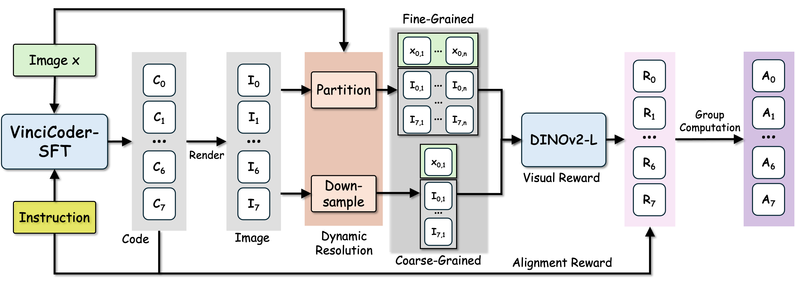

# VinciCoder: Unifying Multimodal Code Generation via Coarse-to-fine Visual Reinforcement Learning
[](https://huggingface.co/collections/DocTron-Hub/vincicoder) [](https://huggingface.co/collections/DocTron-Hub/vincicoder-train-data) [](https://arxiv.org/abs/2511.00391)

## Installation
We recommand following the instruction in [ms-swift](https://github.com/modelscope/ms-swift?tab=readme-ov-file#%EF%B8%8F-installation) and [EasyR1](https://github.com/hiyouga/EasyR1?tab=readme-ov-file#installation) to install the environments.

Also, you could install the RL environments via
```
git clone https://github.com/DocTron-hub/VinciCoder.git
cd VinciCoder
pip install -e .
```

## Dataset


### SFT Dataset
The SFT dataset contains 1.6M data. The dataset is avialable at [VinciCoder_SFT_Data](https://huggingface.co/datasets/DocTron-Hub/VinciCoder-1.6M-SFT).
The existing dataset are collected from the following works. We are very grateful for their excellent work and opensource data. We also optimize and generate new data, see the above Huggingface link for all the data source.
|  Domain   | Paper  |
|  ----  | ----  |
| Chart-to-code |  [ChartCoder](https://arxiv.org/abs/2501.06598), [MSRL](https://arxiv.org/abs/2508.13587), [VisCodex](https://www.arxiv.org/abs/2508.09945)  |
| Web-to-HTML  |  [Web2Code](https://arxiv.org/abs/2406.20098), [Web2M](https://arxiv.org/abs/2404.06369),  [VisCodex](https://www.arxiv.org/abs/2508.09945)  |
| Image-to-SVG | [UniSVG](https://arxiv.org/abs/2508.07766), [StarVector](https://arxiv.org/abs/2312.11556) |
| Image-to-Latex | [DaTikZ](https://arxiv.org/abs/2503.11509), [MathCoder-VL](https://arxiv.org/abs/2505.10557) |
| Others | [CoSyn](https://arxiv.org/abs/2502.14846) |

### RL Dataset
The RL dataset contains 42k data from five domains. The dataset is avialable at [VinciCoder_RL_Data](https://huggingface.co/datasets/DocTron-Hub/VinciCoder-42k-RL).

## Training Scripts 
### SFT stage
Our SFT stage utilize ms-swift, please follow the official document for training.

### RL stage

Our RL stage based on Easyr1, please first modify the configurations in ```./examples/qwen3vl_8b_vincicder.sh``` and check the config in ```./examples/reward_function/vincicoder.py``` and run the following scripts
```
bash ./examples/qwen3vl_8b_vincicder.sh
```

## Contact

For any questions, you can contact [2429527z@gmail.com](mailto:2429527z@gmail.com) or open an issue.


## Citation
If you find this work useful, consider giving this repository a star ⭐️ and citing 📝 our paper as follows:
```
@article{zhao2025vincicoder,
  title={VinciCoder: Unifying Multimodal Code Generation via Coarse-to-fine Visual Reinforcement Learning},
  author={Zhao, Xuanle and Jiang, Deyang and Zeng, Zhixiong and Chen, Lei and Qiu, Haibo and Huang, Jing and Zhong, Yufeng and Zheng, Liming and Cao, Yilin and Ma, Lin},
  journal={arXiv preprint arXiv:2511.00391},
  year={2025}
}

@article{chen2025breaking,
  title={Breaking the sft plateau: Multimodal structured reinforcement learning for chart-to-code generation},
  author={Chen, Lei and Zhao, Xuanle and Zeng, Zhixiong and Huang, Jing and Zheng, Liming and Zhong, Yufeng and Ma, Lin},
  journal={arXiv preprint arXiv:2508.13587},
  year={2025}
}

@article{zhao2025chartcoder,
  title={Chartcoder: Advancing multimodal large language model for chart-to-code generation},
  author={Zhao, Xuanle and Luo, Xianzhen and Shi, Qi and Chen, Chi and Wang, Shuo and Liu, Zhiyuan and Sun, Maosong},
  journal={arXiv preprint arXiv:2501.06598},
  year={2025}
}
```


## Acknowledgement
The training frameworks are based on the [ms-swift](https://github.com/modelscope/ms-swift) and [EasyR1](https://github.com/hiyouga/EasyR1). Thanks for these great works and open sourcing!
