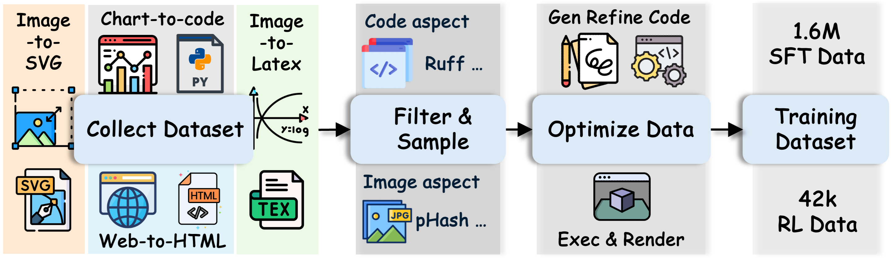

# VinciCoder: Unifying Multimodal Code Generation via Coarse-to-fine Visual Reinforcement Learning
[](https://huggingface.co/collections/DocTron-Hub/vincicoder) [](https://huggingface.co/collections/DocTron-Hub/vincicoder-train-data)

## Dataset


### SFT Dataset


### RL Dataset
The RL dataset contains 42k data from five domains. The dataset is avialable at [VinciCoder_RL_Data](https://huggingface.co/datasets/DocTron-Hub/VinciCoder-42k-RL).

## Training Scripts 
Our SFT stage utilize ms-swift, please follow the official document for training.


Our RL stage based on Easyr1, please first modify the configurations in ```./examples/qwen3vl_8b_vincicder.sh``` and check the config in ```./examples/reward_function/vincicoder.py``` and run the following scripts
```
bash ./examples/qwen3vl_8b_vincicder.sh
```


## Acknowledgement
The training datasets are collected from the following works.

The training frameworks are based on the [ms-swift](https://github.com/modelscope/ms-swift) and [EasyR1](https://github.com/hiyouga/EasyR1). Thanks for these great works and open sourcing!